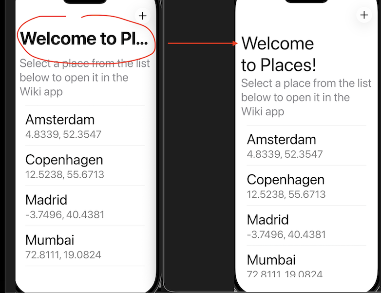
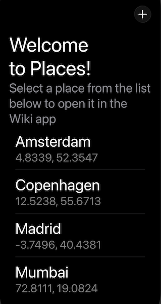

# places-ios

This is the SwiftUI's Places test assignment app.

## Modified Wikipedia app

For the Wikipedia tweak app, see
https://github.com/gatamar/wikipedia-ios (branch `places-app-deeplink-support`)

You can also read the diff here: https://github.com/gatamar/wikipedia-ios/compare/main...places-app-deeplink-support

## Requirements

+ **Xcode 26+** (Xcode 26.3 for sure)
+ **iOS 26+**

## Architecture

+ `MVVM` with some elements of clean architecture is used.
+ Instead of `Published`+`Combine`, Apple-recommended `Observation` framework is used for ViewModels.
+ SwiftUI's navigation is used. 
+ Dependencies are declared at the app's root; they are injected explicitly into each View/ViewModel which needs them. SwiftUI's `Environment` should probably have been used, but I haven't found an elegant way to properly pass those from a `View` to `ViewModel`, given `ViewModel`'s are owned and created by `View`s in this app.

## The Deeplink Scheme

`wikipedia://places` scheme is reused, with `WMFCoord` query item name introduced.
`Places` app's coordinates are passed as a URL-encoded `WMFCoord` query item values.

E.g. for Amsterdam record the deeplink is `wikipedia://places?WMFCoord=lat%3D52.3547498%26long%3D4.8339215`.

The deeplink construction logic is owned by `PlacesDeeplinkFormatter`.

## Accessibility

### Dynamic Type

Supported by the standard `SwiftUI` components like `Text`.
```swift
Text("Welcome to Places!")
	.font(.largeTitle)
```
has been used instead of `.navigationTitle("Welcome to Places!")` in order for the text not to be truncated when the font size is large.



### Dark Mode

+ supported by the standard `SwiftUI` components
+ no custom colors were used, and `.foregroundStyle(.secondary)` works well in the Dark Mode



### VoiceOver

+ full voice over support was added to the PlacesList screen (accessibility labels, hints, hidden modifier)
+ AddCustomPlace screen was much trickier:
	+ accessibility labels were added for toolbar icons
	+ the current city name label has a built-in accessibility
	+ the map navigation itself is possible with a rotor (built-in behaviour)
	+ the location permission dialog also has a built-in accessibility support 

## Swift Concurrency

+ `Task`, `async`/`await`
+ SwiftUI View's `.task` modifier
+ `TaskGroup` with a custom cap for an efficient client backfill of unnamed locations
+ `SWIFT_DEFAULT_ACTOR_ISOLATION` is `nonisolated` as opposed to Swift6-migration-related `MainActor`

While it's possible to use the `AsyncStream` to observe the `LocationRepository` updates in a reactive fashion, a simpler (and uglier, but [recommended](https://github.com/swiftlang/swift-evolution/blob/main/proposals/0395-observability.md) by Apple) `Observation` framework is used instead.

## Known issues

### UX debt

+ would be nice to have a search bar on AddCustomPlace screen, like in Google Maps app
+ the localizations are missing
+ currently the custom place is named by a detected city to match the backend schema - while a lot of interesting placemarks can be found in a city, handling this properly would require an extensive testing. E.g. `CLPlacemark.name` was sometimes returning just a ZIP code to me, that's why I ended up with `CLPlacemark.locality`.

### tech debt

+ a deprecated `CLGeocoder` API is used because of its simplicity